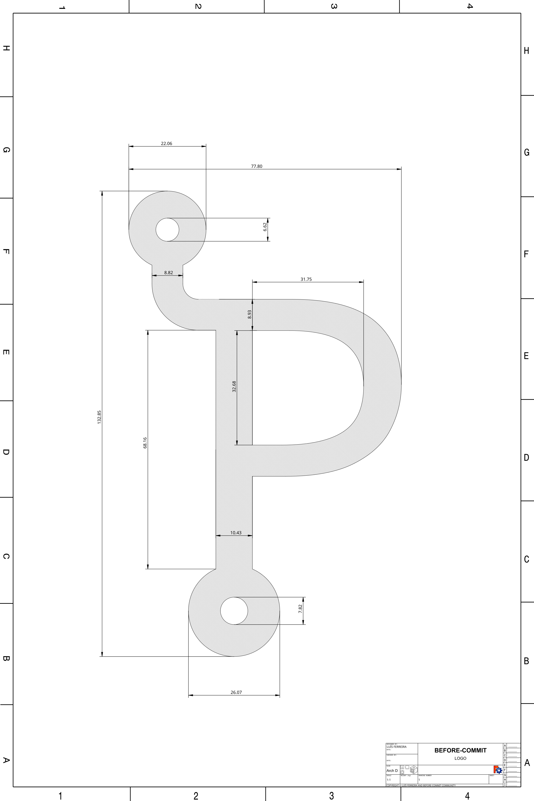

# Design

Specification of the logo created for before-commit

## Specifications

Additionally:

- The _"glyph"_ is either black or white.
- Colored background uses the `#0078c1` RGB color code.
- Gray scale background uses the `#999999` RGB color code.
- The border or circle radius is optional and the dimensions are described in
  `before-commit-border.svg` file.

## Meaning

You can interpret it as a _forked P_ or subliminally a _flipped B_.

## License

[CC BY-SA 4.0](LICENSE)

Copyright (c) 2022 Luís Ferreira and before-commit community

**NOTE:** All products, services or anything associated to trademarks and service
marks used or referenced on this project are the property of their respective
companies/owners or its subsidiaries. Other names and brands may be claimed as
the property of others.
